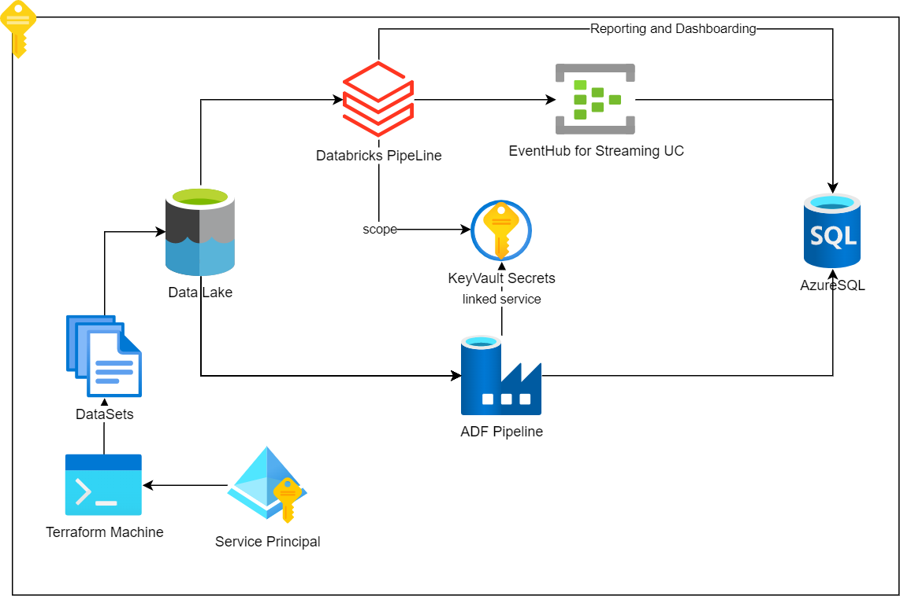

# Smallest Analytical Platform Ever (ProjectZ)  
**https://github.com/anogues/ProjectZ**  
**Albert Nogués Sabater. 2022.**  
**http://www.albertnogues.com**  

The purpose of this project is to create a cloud analytical platform to use it as a PoC or demo, to show a diverse subset of technologies and tools while keeping a minimal working environment to your friends, clients or to learn or play with.
It's currently under construction and any help, ideas or changes are very welcome. You can fork this repo, modify and submit a PR. I will add any interesting stuff as soon as its in line with the project  

INTRODUCTION:
The first version will run solely on azure. The objective is to show the following technologies/disciplines:
* Infrastructure as a Code (IaaC), by using Terraform
* Cloud architecture and Cloud Ops by using an azure cloud environment
* Data Engineering by using a Spark powered Databricks Notebook and an ADF Pipeline (future)
* DevOps to trigger some pipelines based on changes (future)
* Basic Security concepts (keyvault, service principals, least privileged rbac accesses...)
* FinOps keeping the costs at minimum and choosing the proper tools for the job
* Reporting and Dashboarding on data in the platform
* Data management: We will use an adls storage account and azure sql db

TOOLS:
* Terraform to deploy all the infra as a code
* Azure Cloud to host our resources, including:
    + Keyvault
    + ADLS gen2 powered Storage Account
    + Databricks Workspace
    + EventHub Namespace and an EvenHub
    + DataFactory (in progress)
    + Azure SQL DB
    + Azure DevOps workspace (future)
* Access to the azure portal to configure manually the secret scope (see known issues and limitations)

ARCHITECTURE:

* See the Architecture draw.io file for a graphical representation
* main.tf contains all azure resource creation
* main_databricks.tf contains databricks stuff (notebook upload, cluster creation ...)
* main_adf.tf contains datafactory pipeline, linked services... stuff (future)

PROJECT: (Roughly an sketch for the moment)
* We are copying two json files to the datalake
* One will be ingested in our Azure SQL Database from a DataFactory Pipeline
* The other will be streamed from the eventhub into the azuresql database from a databricks notebook
* Then we will use Databricks to run some sample charts and sql queries from the notebook to the database to show some test UC

WARNING:
This demo shouldnt be used for any production deployment as there are a lot of aspects didn't catered for:
* Proper security: Even we will use KeyVaults
* Scalability: We use minimal tiers/skus to make this PoC as cheap as possible
* Taylored solution: This only intents to show a minimal platform that may or may not suit your use cases.
* Management and backup of the tfstate files: currently it's only local, we are not using any cloud storage file system, which should be best practice.
* There is a random string of 5 chars added to any resource name in azure to avoid collisions. But still in this case with lot of very bad luck collisions can happen. Just simply destroy and apply it again to get a new random string.

REQUIREMENTS:
* Cloning this repository
* Terraform (Version 1.1.9) with the following providers:
    + provider registry.terraform.io/databrickslabs/databricks v0.5.7
    + provider registry.terraform.io/hashicorp/azurerm v2.99.0
* az cli and databricks cli (not really needed for the moment)
* an AAD service principal with it's secret and RBAC role Owner of the subscription (or either a custom role including contributor permisisons and also permissions to assign RBAC roles, or remove the rbac assignment from terraform code)

HOW TO RUN IT:
* Clone the repo in your local computer.
* Create a file called terraform.tfvars to supply your subscription_id, tenant_id, client_id and secret_id (or add them directly though the console or by modifying the variables.tf)
* Adjust any other variable in case you desire so (azure datacenter or any variable name in the variables.tf file)
* Run terraform plan to review all works fine
* Run terraform apply to submit the resource creation
* Run terraform destroy to remove everything

KNOWN ISSUES:
* When deleting ADLS gen2 path on a terraform destroy you get some message like they are not empty. I think this is because even the files have been deleted azure has not been fully refreshed (maybe because of replication) --> Solve it by relaunching terraform destroy again and it will work
* I don't know why but sometimes the adls gen2 path creation apparently fails, but in fact it has been created, so we need to add to the tfstate to get ridd of the error --> terraform import azurerm_storage_data_lake_gen2_path.dataset https://<storageaccountname>.dfs.core.windows.net/raw/dataset
* Create Databricks Secret Scope impossible using a SP. Currently, it's only possible to create Azure Key Vault scopes with Azure CLI authentication and not with Service Principal. Maybe we can switch to az login terraform security or find a workarround with the databricks cli, create a PAT token configure the workspace and create the scope from a named user PAT? --> https://registry.terraform.io/providers/databrickslabs/databricks/latest/docs/resources/secret_scope

LIMITATIONS:
* For the moment the secret scope in databricks can't be automated. Read the known issues section. So it has to be created manually in the workspace https://<databricks-instance>#secrets/createScope (see https://docs.microsoft.com/en-us/azure/databricks/security/secrets/secret-scopes#create-an-azure-key-vault-backed-secret-scope-using-the-databricks-cli)

TODO:
* Check TODO.md file for the next steps